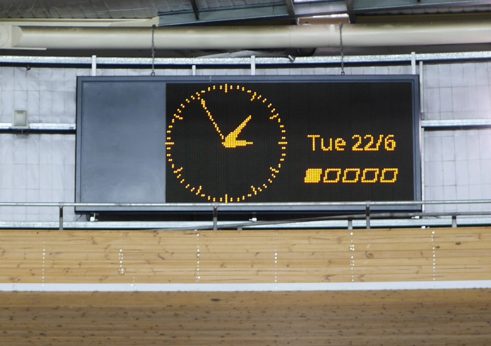

# caprica

Crude Galactica/DHI replacement

Caprica provides a minimal-function replacement for Galactica
on older monochrome LED scoreboards from Omega (Swiss Timing)
eg: Leurocomm m20. It implements an analog clock and a
fixed-width text matrix for results and timing screens.

Whole display frames are output to a unix domain socket as a
cairo FORMAT_A1 buffer of 1 bit pixels packed into 32-bit
quantities in host-native byte order.

For a compatible hardware interface to the Leurocomm m20 that runs
on a Beaglebone Black, see the project leuro-m20-bbb.

## Requirements

- Python 3
- Cairo

